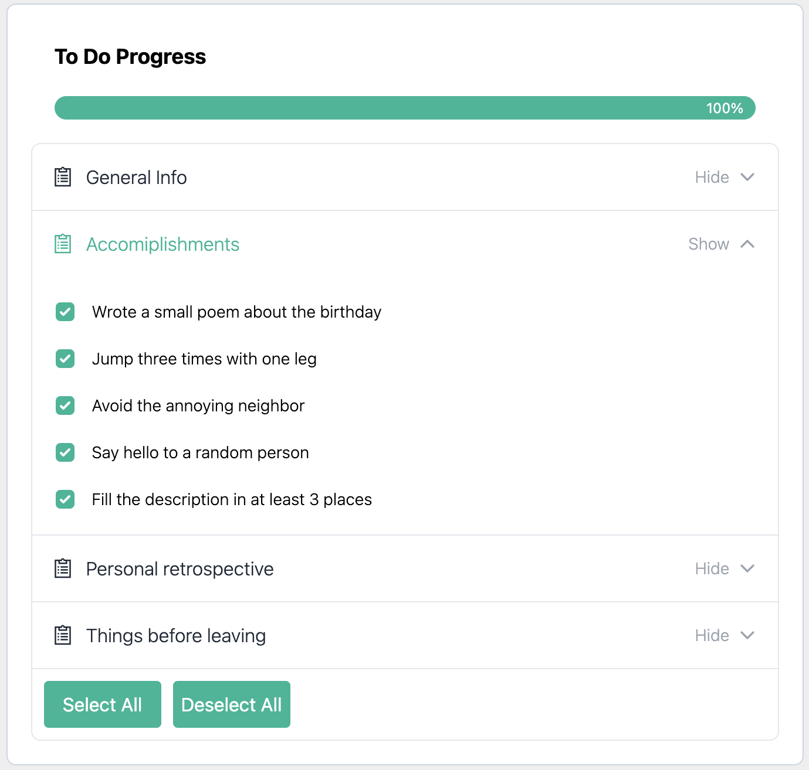

# To Do Progress Widget

This project is implemented with React, Typescript and Tailwind. It is a widget that shows the current progress of the profile creation of the user. The user should be able to see the missing tasks of a specific area and be able to mark them as done.

## Available Scripts

In the project directory, you can run:
### `yarn`

And then:

### `yarn start`

